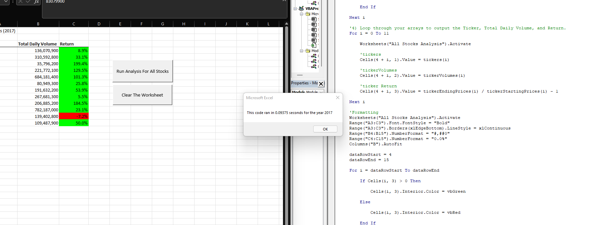
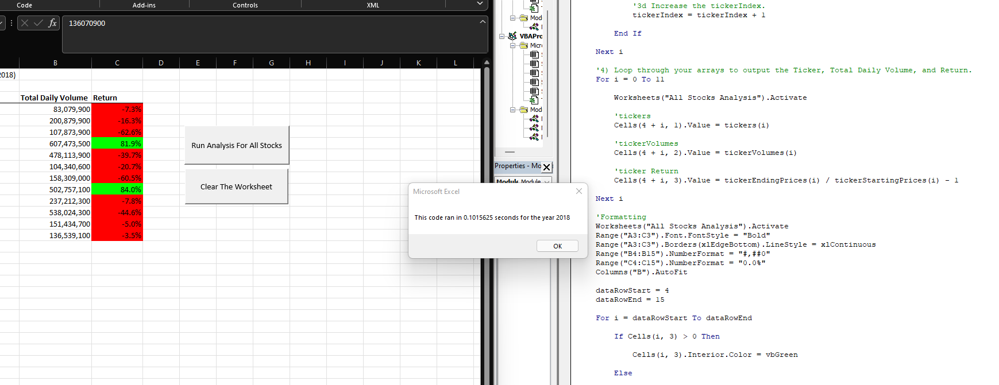

# Module 2: Stock Analysis

## Overview of Project

### Purpose
The purpose of this project was to use for loops to refactor the previously made code within the module. the purpose of refactoring the code was to make it run faster.  The faster the code, the more points of data that it can run though within a timely basis.

### Background
The background of this project deals with stock analysis.  Steve's parents purchased "DQ" stock but Steve believes that there is other stock that would be better for them.  The analysis of the stock shows us which stocks were positive and which were negative for 2017 or 2018. Although the data that Steve provided us was not that large, the refactored code could handle a larger file.

## Results

